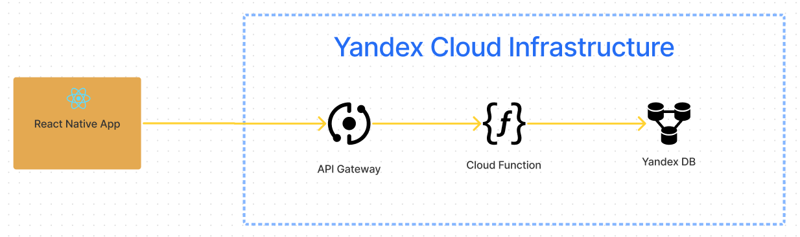

# Blazma

Mobile chat application

## Application backend
###### Common scheme:

###### API 
| Path         | Method | Query parameters | Request Body | Response body | Description |
|--------------|--------|------------------|--------------|---------------|-------------|
| `/v1/status`   | GET    |                  |              |               |             |
| `/v1/messages` | GET    |                  |              |               |             |
| `/v1/messages` | POST   |                  |              |               |             |
| `/v1/signin`   | POST   |                  |              |               |             |
| `/v1/signout`  | POST   |                  |              |               |             |

###### Environment variables
`SA_JSON_FILE` 
`DB_NAME`
`ENTRY_POINT`
